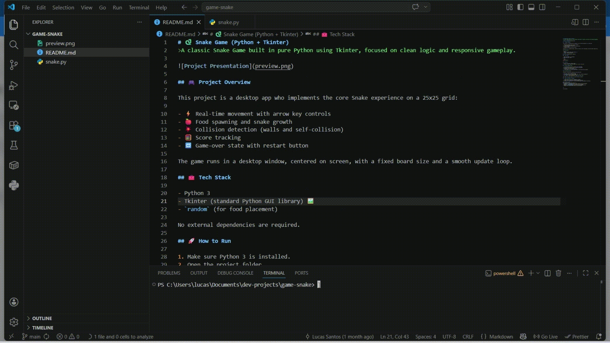

# 🐍 Juego de la Serpiente (Python: Tkinter + Pygame)
>Un clásico Juego de la Serpiente (Snake) hecho en Python, implementado en dos versiones: una con Tkinter y otra con Pygame, enfocado en una lógica limpia y una jugabilidad fluida.

🌍 **Léelo en otros idiomas:** [English](../README.md) | [Português](README.pt-BR.md)



## 🎮 Descripción General del Proyecto

Este proyecto implementa la experiencia principal de Snake en una cuadrícula de 25x25 como una aplicación de escritorio. El mismo juego está desarrollado de dos formas distintas, para que puedas comparar cómo cada biblioteca maneja las ventanas, la entrada del teclado, el dibujo y el bucle del juego:

| | 🖼️ Versión Tkinter | 🕹️ Versión Pygame |
|---|---|---|
| 📁 Ubicación | [`tkinter/snake.py`](../tkinter/snake.py) | [`pygame/snake.py`](../pygame/snake.py) |
| 📦 Dependencias | Ninguna (biblioteca estándar) | `pygame` |
| 🎯 Controles | Flechas del teclado | Flechas o `W` `A` `S` `D` |
| 🐣 Posición inicial | Fija (zona superior izquierda) | Aleatoria |
| 🧮 Puntuación | ✅ Se muestra al perder | ❌ Todavía no |
| 🧱 Colisión con la pared | Fin del juego | La serpiente y la comida se reinician automáticamente |
| 🪞 Colisión consigo misma | ✅ Fin del juego | ❌ Todavía no |
| 🔁 Reiniciar | Botón de reinicio | Automático |
| 🏃 Bucle del juego | `window.after(100, draw)` | `while True` + `clock.tick(10)` |
| 🚧 Estado | Completa | Versión inicial (en desarrollo) |

## 🖼️ Versión Tkinter

La versión original y más completa, construida solo con la biblioteca estándar de Python.

- ⚡ Movimiento en tiempo real con las flechas del teclado (no se permite invertir la dirección)
- 🍎 Aparición de comida y crecimiento de la serpiente
- 💥 Detección de colisiones (paredes y consigo misma)
- 🧮 Conteo de puntos
- 🔁 Pantalla de fin del juego con botón de reinicio
- 🪟 Ventana centrada en la pantalla con un tablero de tamaño fijo

### 🧠 Notas de Arquitectura

- 🧩 Una clase `Cell` para las posiciones del tablero
- 🌐 Variables globales de estado del juego (snake, food, score, velocity, game_over)
- 🏃 Una función `move()` para las actualizaciones del juego
- 🖌️ Un bucle `draw()` programado con `window.after(100, draw)` (10 actualizaciones por segundo)

## 🕹️ Versión Pygame

Una versión más reciente que reconstruye el juego usando [Pygame](https://www.pygame.org/), una biblioteca creada específicamente para videojuegos. Todavía es una versión inicial y se está desarrollando paso a paso.

- ⚡ Movimiento con las flechas o `W` `A` `S` `D`
- 🍎 Aparición de comida y crecimiento de la serpiente
- 🎲 La serpiente y la comida comienzan en posiciones aleatorias
- 🧱 Salir del tablero reinicia la serpiente y la comida

### 🧠 Notas de Arquitectura

- 🟩 Objetos `pygame.Rect` para los segmentos de la serpiente y la comida
- 🔄 Un bucle de juego clásico `while True` que gestiona eventos, actualizaciones y dibujo
- ⏱️ `pygame.time.Clock` limita el juego a 10 cuadros por segundo
- 📐 `window.get_rect().contains(...)` comprueba si la serpiente está dentro del tablero

## 🧰 Tecnologías

- Python 3
- Tkinter (biblioteca gráfica estándar de Python) 🖼️
- Pygame (biblioteca para desarrollo de videojuegos) 🕹️
- `random` (para colocar la comida)

## 🚀 Cómo Ejecutar

1. Asegúrate de tener Python 3 instalado.
2. Abre la carpeta del proyecto.

### 🖼️ Versión Tkinter

No se necesitan dependencias externas:

```bash
python tkinter/snake.py
```

### 🕹️ Versión Pygame

Primero instala Pygame:

```bash
pip install pygame
```

Luego ejecuta:

```bash
python pygame/snake.py
```

## 🎯 Controles

- ⬆️⬇️⬅️➡️ Flechas del teclado: mueven la serpiente (ambas versiones)
- 🔤 `W` `A` `S` `D`: mueven la serpiente (versión Pygame)
- 🔄 Botón de reinicio: aparece al perder para comenzar una nueva partida (versión Tkinter)

## 📜 Reglas Actuales del Juego

### 🖼️ Versión Tkinter

- 🐣 La serpiente comienza cerca de la zona superior izquierda del tablero.
- 🍽️ Comer la comida aumenta la puntuación y hace crecer a la serpiente.
- 🧱 Chocar contra una pared termina el juego.
- 🪞 Chocar contra tu propio cuerpo termina el juego.
- ♻️ Después de perder, usa el botón de reinicio para volver a jugar.

### 🕹️ Versión Pygame

- 🎲 La serpiente y la comida comienzan en posiciones aleatorias.
- 🍽️ Comer la comida hace crecer a la serpiente.
- 🧱 Salir del tablero reinicia la serpiente y genera una nueva comida.

## 🌟 Por Qué Este Proyecto Es Valioso

- 📌 Demuestra la programación orientada a eventos en Python
- 🔍 Muestra patrones prácticos de bucle de juego y gestión de estado
- ⚖️ Compara dos enfoques (toolkit gráfico vs. biblioteca de videojuegos) para el mismo juego
- 🧱 Sirve como una base sólida para aprender desarrollo de interfaces gráficas y arquitectura de videojuegos

## 🌐 Conecta Conmigo
Sigue mi trayectoria y otros proyectos en:

[](https://www.linkedin.com/in/lucsantosdev)
[](https://github.com/lucsantosdev)
[](mailto:lucsantosdev@gmail.com)
[](https://youtube.com/@lucsantosdev)
[](https://ko-fi.com/lucsantosdev)

---

🧠 Je 9:23-24
